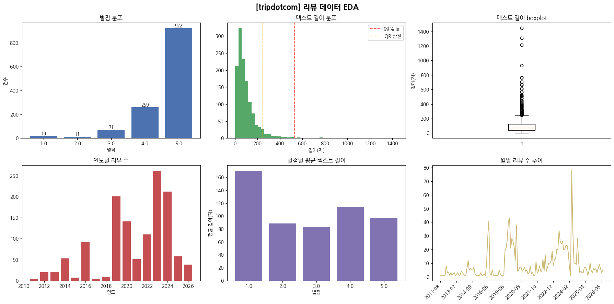

# YBIGTA_newbie_team_project

# [4회차] EDA & FE, 시각화 과제

## 1. EDA
 
 
 
### 카카오맵

- 이상치 유형
  - content 결측: 65건
  - content 중복: 15건
  - 텍스트 길이 IQR 초과: 12건
 
 
### 트립어드바이저

- 이상치 유형
  - content 결측 및 중복: 0건
  - 텍스트 길이 IQR 초과: 102건
 
 
### 트립닷컴

- 이상치 유형
    - content 결측: 0건
    - content 중복: 24건
    - 텍스트 길이 IQR 초과: 64건
 
 
### 공통 유형

- 별점 분포: 세 사이트 모두 5점에 쏠림

- 텍스트 길이 분포: 세 사이트 모두 right - skewed된 분포 보임
    - 사이트별 평균 텍스트 길이 차이 존재
        - 카카오 37자, 트립닷컴 101자, 트립어드바이저 130자

- 리뷰 길이 관련 이상치
    - 매우 길이가 긴 리뷰(1400자 이상): 실제로 확인 시, 중복되거나 무의미한 스팸이 아닌 실제로 내용을 가지고 작성된 장문의 리뷰임
    - 따라서 실제로 전처리 수행 시, 길이 이상치는 하한값만 잘라내는 것에 대한 근거로 사용하였음