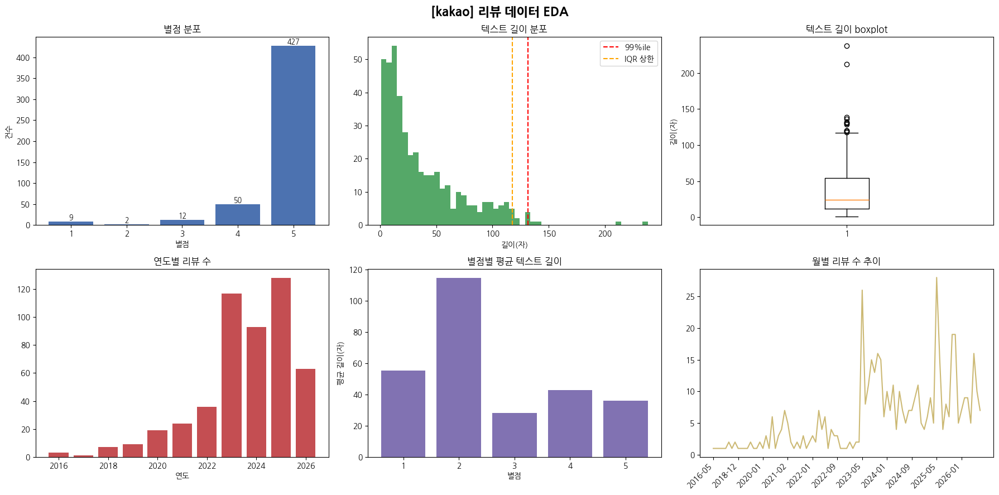
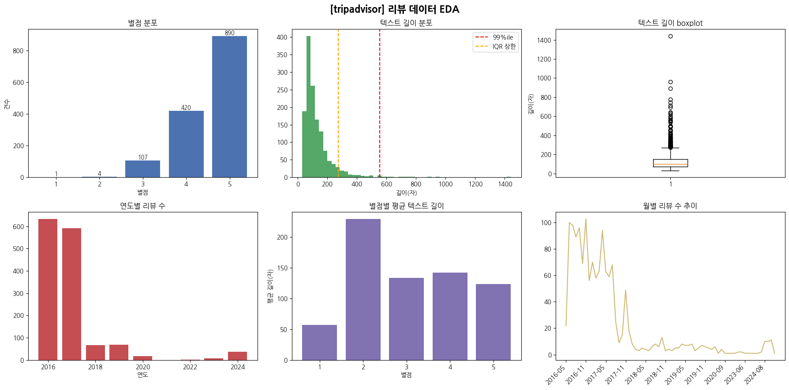

# YBIGTA_newbie_team_project

# [4회차] EDA & FE, 시각화 과제

## 1. EDA
 
 
 

### 카카오맵

- 이상치 유형
  - content 결측: 65건
  - content 중복: 15건
  - 텍스트 길이 IQR 초과: 12건
 
 

### 트립어드바이저

- 이상치 유형
  - content 결측 및 중복: 0건
  - 텍스트 길이 IQR 초과: 102건
 
 

### 트립닷컴

- 이상치 유형
    - content 결측: 0건
    - content 중복: 24건
    - 텍스트 길이 IQR 초과: 64건
 
 

### 공통 유형

- 별점 분포: 세 사이트 모두 5점에 쏠림

- 텍스트 길이 분포: 세 사이트 모두 right - skewed된 분포 보임
    - 사이트별 평균 텍스트 길이 차이 존재
        - 카카오 37자, 트립닷컴 101자, 트립어드바이저 130자

- 리뷰 길이 관련 이상치
    - 매우 길이가 긴 리뷰(1400자 이상): 실제로 확인 시, 중복되거나 무의미한 스팸이 아닌 실제로 내용을 가지고 작성된 장문의 리뷰임
    - 따라서 실제로 전처리 수행 시, 길이 이상치는 하한값만 잘라내는 것에 대한 근거로 사용하였음

---
 
 

## 2. 전처리/FE

### 전처리 파이프라인

#### 1. 결측치 처리

- rating, date, content 중 하나라도 결측히면 해당 행 제거
  - 별점만 남기고 텍스트 작성하지 않은 리뷰는 텍스트 분석 대상 불가
  - 결측치 처리와 더불어서, 중복된 리뷰를 제거하였음
 
 

#### 2. 이상치 처리

- 세 가지 측면에서 이상치 판별

  - 별점 범위: 1 ~ 5점 범위를 벗어나는 값과 숫자로 변환되지 않는 값을 제거 대상으로 두었음
    - 해당사항 없어 실제 제거는 발생하지 않음
   
   

  - 기간(날짜): 날짜 문자열을 datetime으로 파싱한 뒤, 파싱 실패 / 미래 날짜 / 20년 초과 과거를 제거
    - 모든 데이터의 date 형식을 YYYY-MM-DD 형식으로 통일하였음
   
   

  - 텍스트 길이 - 하한 이상치만 적용
    - IQR 상한은 적용하지 않음
      - EDA 결과 확인 시, 리뷰 길이는 right-skewed 된 분포임 >> 짧은 리뷰가 대다수 -> 이 분포에 IQR 규칙 적용 시 정상 범주의 리뷰까지 잘려나감

      - 가장 긴 리뷰들을 직접 확인한 결과 정상 장문 리뷰였음 -> 정보량이 많아 보존하는것이 타당하다고 판단하였음

    - 분석이 불가능한 하한(2자 미만, 토큰이 0개인 리뷰)만 제거함
 
 

#### 3. 텍스트 데이터 전처리

- 다음과 같은 순서로 텍스트 데이터를 전처리하였음

| 순서 | 처리 | 비고 |
|---|---|---|
| 1 | 이모지 제거 | 제거 **전** 개수를 `emoji_count`로 보존 |
| 2 | 자음/모음 표현 제거 | `ㅋㅋ`, `ㅎㅎ`, `ㅠㅠ` 등 |
| 3 | 특수문자 제거 | 한글·영문·숫자·기본 문장부호(`.,!?`)만 유지 |
| 4 | 반복 문자 축약 | `좋아요!!!!!` → `좋아요!!` |
| 5 | 연속 공백 정리 | |
 
 

#### 4. 파생변수
| 변수 | 설명 |
|---|---|
| site | 사이트 구분자, 세 CSV 합쳐 비교분석시 사용 |
| year / month / weekday | date에서 추출한 시간 파생변수 |
| text_len | 정제 후 본문 길이 |
| token_count | 토큰 갯수 |
| emoji_count | 원문의 이모지 갯수 | |

  - weekday 값 정의
    - pandas 의 dt.dayofweek 기준
    - {0: 월, 1: 화, 2: 수, 3: 목, 4: 금, 5: 토, 6: 일}
 
 

#### 5. 텍스트 벡터화

- 벡터화 방식 검토
  - **BERT 임베딩**: 고차원 실수 벡터라 개별 키워드 해석 불가.
    - 또한 한국어 지원 모델은 다국어 계열(bge-m3)로 한정되며 약 2.2GB로 무거움

  - **TF-IDF 채택**: 단어 단위 가중치라 키워드 해석이 가능함
    - LDA·워드클라우드·빈도분석이 동일 행렬에서 파생됨

- 코퍼스 통합 fit
  - 사이트별로 각자 fit하면 vocabulary가 달라져 사이트간 비교 불가
  - 세 사이트 리뷰를 합쳐 한 번만 fit → 동일 어휘 축(2,441개) 위에 정렬

- 차원 축소
  - 2,441차원 희소 벡터를 그대로 CSV에 저장 시 컬럼 2,444개 / 15MB
  - TruncatedSVD로 16차원 압축 (27컬럼 / 1.2MB)
  - 압축 후에도 의미 유사도 보존 확인 (동일 주제 리뷰 간 코사인 유사도 0.548 vs 타 주제 0.386)

- 단어 자체가 필요한 분석을 위해 `tokens` 컬럼 별도 제공

## 3. 비교분석

### 3.1. 리뷰 스타일 비교

![리뷰 스타일 비교]

- **사이트별 리뷰 스타일 요약**
  - **카카오맵 (407건)**: 평균 글자 수 약 38자, 토큰 수 6개로 세 사이트 중 가장 짧고 직관적인 단문 위주의 후기. 평균 별점은 4.78점으로 가장 높음.
  - **트립어드바이저 (1,500건)**: 평균 글자 수 약 129자, 토큰 수 19개로 가장 상세하고 긴 호흡의 리뷰가 주를 이룸. 반면 이모지 사용량(평균 0.004개)은 극히 적음.
  - **트립닷컴 (1,272건)**: 평균 글자 수 약 100자로 중간 수준의 길이. 이모지 사용량(평균 0.23개)이 카카오맵과 비슷하게 활발함.

 
 

### 3.2. 사이트별 주요 키워드 비교 (Top 15)

![사이트별 키워드 비교]

- **플랫폼별 이용자의 방문 목적 차이 확인**
  - **카카오맵**: `조선(29회)`, `야간(27회)`, `개장(24회)` 등의 키워드가 상위권에 위치하여, 주로 한국인들이 경복궁 야간 개장 등의 이벤트에 맞춰 방문하는 경향을 보여줌.
  -  **트립어드바이저**: `궁전(557회)`, `서울(401회)`, `한국(401회)`, `역사(373회)`, `팰리스(326회)` 등 명소 관광 관점의 키워드가 많음. 외국인 관광객들이 한국의 명소인 경복궁을 방문하는 경향을 보여줌.
  -  **트립닷컴**: `한복(495회)`, `입다(368회)`, `사진(248회)`, `찍다(178회)` 등의 키워드가 상위권임. 경복궁 자체의 관람보다는 한복 체험과 사진 촬영 등을 목적으로 방문하고 있음을 추측할 수 있음.

 
 

### 3.3. 시계열 추이 비교

![연도별 리뷰 수 추이]

- **연도별 리뷰 작성 수 추이**
  - **카카오맵**: 2023년(94건)부터 급증하여 2025년(109건)에 정점을 찍는 등 최근 들어 리뷰 유입이 가장 활발
  - **트립어드바이저**: 2016년(711건)과 2017년(591건)에 리뷰가 집중, 이후 감소 추세
  - **트립닷컴**: 코로나 이전인 2019년(200건)과, 2023년(260건), 2024년(208건)에 뚜렷한 피크

![월별 리뷰 수 추이]

- **월별(계절성) 리뷰 작성 수 추이**
  - **카카오맵**: 5월(74건)에 피크
  - **트립어드바이저**: 5월(177건)부터 7월(182건)까지 초여름에 리뷰가 집중
  - **트립닷컴**: 4월(178건)과 5월(140건)에 가장 활발  

 
 

### 3.4. 감정 분석 및 감정별 주요 키워드

![감정 분포 비교]

- **별점 기반 감정 라벨링 기준 (4~5점: Positive / 3점: Neutral / 1~2점: Negative)**
- **감정 분포 특징**: 카카오맵(391건/96%), 트립어드바이저(1,382건/92%), 트립닷컴(1,171건/92%) 세 곳 모두 긍정(Positive) 리뷰가 90% 이상을 차지하는 긍정 편향 데이터.

![감정별 키워드 비교]

- **부정 리뷰(Negative) 키워드 분석**
  - **트립닷컴의 명확한 불만 요인**: 부정 리뷰 30건에서 `티켓(14회)`, `환불(14회)`, `플랫폼(13회)`, `예약(6회)`, `낭비(6회)` 등의 키워드가 뚜렷하게 추출됨.
  이는 경복궁 관람 자체와 관련된 사항보다는, 외부 예매 플랫폼의 결제, 환불, 예약 시스템과 관련된 문제가 주요 불만임을 알 수 있음.

- **분석 한계점 (Contextual Limitation)**
  - 카카오맵과 트립어드바이저의 부정 리뷰 키워드에 `많다`, `좋다` 등의 긍정/중립 단어가 추출되었는데, 이는 '좋지 않다'에서 '좋다'를 추출한 것과 같은 방식으로, 기술적 한계로 인한 결과로 추측됨.
  - 부정 리뷰의 개수 자체가 적어, 부정 리뷰에 대한 분석은 유의미한 분석이 아닐 가능성이 있음. 