# YBIGTA_newbie_team_project


# 팀 및 자기소개

팀: **YBIGTA newbie team 4조**입니다!
 - **김시나**
  - 응용통계학과 25학번 / 05년생
 - **배승민**
  - QRM(계량위험관리전공) 22학번 / 03년생
 - **정호진**
 - 산업공학과 22학번 / 00년생

# [2회차] Web 과제

## index
 - 기본 가로 길이를 Input 박스와 동일하게 수정
 - 버튼 글씨/배경/모서리 수정

## user_router
 - **user login**: user_schema에서 UserLogin(email/password) 객체 호출, 해당 ID 사용자 미존재 or ID/PW 조합 맞지 않을 시  오류 raise
 - **user register**: user_schema에서 User(email/password/username) 객체 호출, 이미 존재하는 사용자일 경우 오류 raise
 - **user delete**: user_schema에서 UserDeleteRequest(email) 객체 호출, 해당 사용자 미존재 시 오류 raise
 - **update user password**: user_schema에서 UserUpdate(email/new_password) 객체 호출, 비밀번호 기존과 동일할 시 오류 raise

## user_response
 - **user login** 기능 구현
  - repo 객체의 email로 유저 찾기
  - 이메일 없음 -> 에러메시지 반환
  - 비밀번호 틀림 -> 에러메시지 반환
  - else: 로그인 성공

 - **user register** 기능 구현
  - repo 객체의 email로 등록할 유저 찾기
  - 이메일 존재함 -> 이미 등록된 유저 -> 에러메시지 반환
  - else: 신규유저 등록

 - **user 삭제** 기능 구현
  - repo 객체의 email로 삭제할 유저 찾기
  - 이메일 없음 -> 존재하지 않는 유저 -> 에러메시지 반환
  - else: 기존유저 삭제

- **user password update** 기능 구현
 - repo 객체의 email로 업데이트할 유저 찾기
 - 이메일 없음 -> 존재하지 않는 유저 -> 에러메시지 반환
 - else: 패스워드 업데이트 후 저장


# [3회차] 크롤링 과제

## 1. 데이터 소개
<br />

### 카카오맵 (Kakao Map)

- **크롤링 대상 사이트**: [카카오맵 경복궁](https://place.map.kakao.com/18619553)
- **크롤링 방식**: `Selenium`을 이용하여 '후기' 탭을 클릭하고 무한 스크롤로 동적 데이터를 로드한 뒤, `BeautifulSoup`을 활용하여 HTML 소스에서 리뷰 데이터 추출
- **데이터 형식**: CSV (`reviews_kakao.csv`, utf-8-sig) / 비정상 종료 시 중간 저장 지원 (`.checkpoint.csv`)
  - 추출 컬럼: `rating` (별점), `date` (작성일, YYYY년 M월 D일 형식), `content` (리뷰 본문)
- **데이터 개수**: 500건 (목표 수집량 설정)
<br />
<br />

### 트립닷컴 (Trip.com)

- **크롤링 대상 사이트**: [Trip.com 경복궁 여행 가이드](https://kr.trip.com/travel-guide/attraction/seoul/gyeongbokgung-palace-78910/)
- **크롤링 방식**: 트립닷컴의 SOA2 API를 활용. `Selenium`을 이용해 봇 탐지를 우회하고 `requests`를 통해 경복궁 리뷰 중 한국어 리뷰 데이터 추출
- **데이터 형식**: CSV (`tripdotcom_reviews.csv`)
  - 추출 컬럼: `reviewId` (고유 식별자), `language` (작성 언어), `rating` (별점), `date` (작성일), `content` (리뷰 본문)
- **데이터 개수**: 약 1,282건 (한국어 리뷰 기준 / 전체 메타데이터 기준 약 5,303건)
<br />
<br />

### 트립어드바이저 (Tripadvisor)

- **크롤링 대상 사이트**: Tripadvisor 경복궁 리뷰 (지역 코드: g294197, 장소 코드: d324888)
- **크롤링 방식**: URL 오프셋 기반 페이지네이션으로 순회하며 리뷰 리스트 페이지의 정적 HTML 파싱. `Selenium`으로 페이지 로드하여 봇 탐지를 우회하고 `BeautifulSoup`으로 데이터 추출
- **데이터 형식**: CSV (`reviews_tripadvisor.csv`, utf-8-sig)
  - 추출 컬럼: `rating` (별점 1.0 ~ 5.0), `date` (리뷰 작성일), `content` (리뷰 본문)
- **데이터 개수**: 1,500건 (전체 약 11,000건 중 과도한 요청을 피하기 위해 목표치 제한, 실제 수집 결과 한국어 리뷰가 99.9%)
<br />
<br />
<br />

## 2. 실행 방법 (Prerequisites)
크롤러를 실행하기 전, 다음 패키지들이 설치되어 있어야 합니다. (**Chrome 브라우저 필수**)

### 카카오맵
```bash
pip install selenium beautifulsoup4 webdriver-manager
```

### 트립닷컴
```bash
pip install requests selenium webdriver-manager
```

### 트립어드바이저
```bash
pip install selenium beautifulsoup4
```

# [4회차] EDA & FE, 시각화 과제


## 1. EDA
<br />
<br />
<br />

### 카카오맵

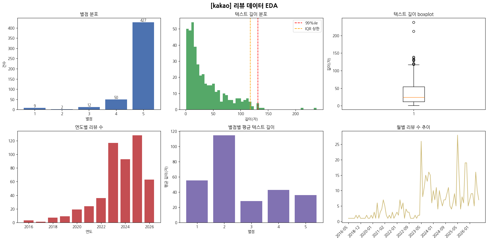

- 이상치 유형
  - content 결측: 65건
  - content 중복: 15건
  - 텍스트 길이 IQR 초과: 12건
<br />
<br />

### 트립어드바이저

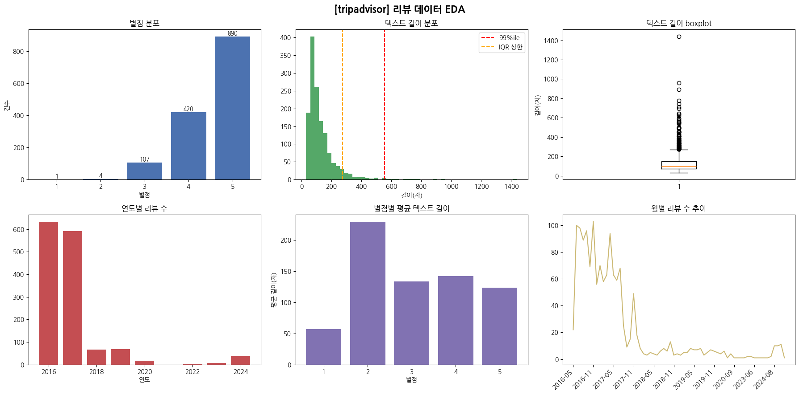

- 이상치 유형
  - content 결측 및 중복: 0건
  - 텍스트 길이 IQR 초과: 102건
<br />
<br />

### 트립닷컴

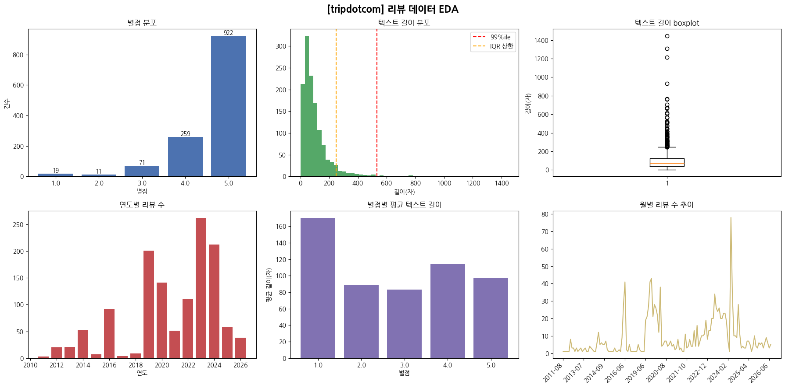

- 이상치 유형
    - content 결측: 0건
    - content 중복: 24건
    - 텍스트 길이 IQR 초과: 64건
<br />
<br />

### 공통 유형

- 별점 분포: 세 사이트 모두 5점에 쏠림

- 텍스트 길이 분포: 세 사이트 모두 right - skewed된 분포 보임
    - 사이트별 평균 텍스트 길이 차이 존재
        - 카카오 37자, 트립닷컴 101자, 트립어드바이저 130자

- 리뷰 길이 관련 이상치
    - 매우 길이가 긴 리뷰(1400자 이상): 실제로 확인 시, 중복되거나 무의미한 스팸이 아닌 실제로 내용을 가지고 작성된 장문의 리뷰임
    - 따라서 실제로 전처리 수행 시, 길이 이상치는 하한값만 잘라내는 것에 대한 근거로 사용하였음

---
<br />
<br />

## 2. 전처리/FE

### 전처리 파이프라인


#### 1. 결측치 처리

- rating, date, content 중 하나라도 결측히면 해당 행 제거
  - 별점만 남기고 텍스트 작성하지 않은 리뷰는 텍스트 분석 대상 불가
  - 결측치 처리와 더불어서, 중복된 리뷰를 제거하였음
<br />
<br />

#### 2. 이상치 처리

- 세 가지 측면에서 이상치 판별

  - 별점 범위: 1 ~ 5점 범위를 벗어나는 값과 숫자로 변환되지 않는 값을 제거 대상으로 두었음
    - 해당사항 없어 실제 제거는 발생하지 않음
  <br />
  <br />

  - 기간(날짜): 날짜 문자열을 datetime으로 파싱한 뒤, 파싱 실패 / 미래 날짜 / 20년 초과 과거를 제거
    - 모든 데이터의 date 형식을 YYYY-MM-DD 형식으로 통일하였음
  <br />
  <br />

  - 텍스트 길이 - 하한 이상치만 적용
    - IQR 상한은 적용하지 않음
      - EDA 결과 확인 시, 리뷰 길이는 right-skewed 된 분포임 >> 짧은 리뷰가 대다수 -> 이 분포에 IQR 규칙 적용 시 정상 범주의 리뷰까지 잘려나감

      - 가장 긴 리뷰들을 직접 확인한 결과 정상 장문 리뷰였음 -> 정보량이 많아 보존하는것이 타당하다고 판단하였음

    - 분석이 불가능한 하한(2자 미만, 토큰이 0개인 리뷰)만 제거함
<br />
<br />

#### 3. 텍스트 데이터 전처리

- 다음과 같은 순서로 텍스트 데이터를 전처리하였음

| 순서 | 처리 | 비고 |
|---|---|---|
| 1 | 이모지 제거 | 제거 **전** 개수를 `emoji_count`로 보존 |
| 2 | 자음/모음 표현 제거 | `ㅋㅋ`, `ㅎㅎ`, `ㅠㅠ` 등 |
| 3 | 특수문자 제거 | 한글·영문·숫자·기본 문장부호(`.,!?`)만 유지 |
| 4 | 반복 문자 축약 | `좋아요!!!!!` → `좋아요!!` |
| 5 | 연속 공백 정리 | |
<br />
<br />

#### 4. 파생변수
| 변수 | 설명 |
|---|---|
| site | 사이트 구분자, 세 CSV 합쳐 비교분석시 사용 |
| year / month / weekday | date에서 추출한 시간 파생변수 |
| text_len | 정제 후 본문 길이 |
| token_count | 토큰 갯수 |
| emoji_count | 원문의 이모지 갯수 | |

  - weekday 값 정의
    - pandas 의 dt.dayofweek 기준
    - {0: 월, 1: 화, 2: 수, 3: 목, 4: 금, 5: 토, 6: 일}
<br />
<br />

#### 5. 텍스트 벡터화

- 벡터화 방식 검토
  - **BERT 임베딩**: 고차원 실수 벡터라 개별 키워드 해석 불가.
    - 또한 한국어 지원 모델은 다국어 계열(bge-m3)로 한정되며 약 2.2GB로 무거움

  - **TF-IDF 채택**: 단어 단위 가중치라 키워드 해석이 가능함
    - LDA·워드클라우드·빈도분석이 동일 행렬에서 파생됨

- 코퍼스 통합 fit
  - 사이트별로 각자 fit하면 vocabulary가 달라져 사이트간 비교 불가
  - 세 사이트 리뷰를 합쳐 한 번만 fit → 동일 어휘 축(2,441개) 위에 정렬

- 차원 축소
  - 2,441차원 희소 벡터를 그대로 CSV에 저장 시 컬럼 2,444개 / 15MB
  - TruncatedSVD로 16차원 압축 (27컬럼 / 1.2MB)
  - 압축 후에도 의미 유사도 보존 확인 (동일 주제 리뷰 간 코사인 유사도 0.548 vs 타 주제 0.386)

- 단어 자체가 필요한 분석을 위해 `tokens` 컬럼 별도 제공

## 3. 비교분석

### 3.1. 리뷰 스타일 비교

![리뷰 스타일 비교]

- **사이트별 리뷰 스타일 요약**
  - **카카오맵 (407건)**: 평균 글자 수 약 38자, 토큰 수 6개로 세 사이트 중 가장 짧고 직관적인 단문 위주의 후기. 평균 별점은 4.78점으로 가장 높음.
  - **트립어드바이저 (1,500건)**: 평균 글자 수 약 129자, 토큰 수 19개로 가장 상세하고 긴 호흡의 리뷰가 주를 이룸. 반면 이모지 사용량(평균 0.004개)은 극히 적음.
  - **트립닷컴 (1,272건)**: 평균 글자 수 약 100자로 중간 수준의 길이. 이모지 사용량(평균 0.23개)이 카카오맵과 비슷하게 활발함.

<br />
<br />

### 3.2. 사이트별 주요 키워드 비교 (Top 15)

![사이트별 키워드 비교]

- **플랫폼별 이용자의 방문 목적 차이 확인**
  - **카카오맵**: `조선(29회)`, `야간(27회)`, `개장(24회)` 등의 키워드가 상위권에 위치하여, 주로 한국인들이 경복궁 야간 개장 등의 이벤트에 맞춰 방문하는 경향을 보여줌.
  -  **트립어드바이저**: `궁전(557회)`, `서울(401회)`, `한국(401회)`, `역사(373회)`, `팰리스(326회)` 등 명소 관광 관점의 키워드가 많음. 외국인 관광객들이 한국의 명소인 경복궁을 방문하는 경향을 보여줌.
  -  **트립닷컴**: `한복(495회)`, `입다(368회)`, `사진(248회)`, `찍다(178회)` 등의 키워드가 상위권임. 경복궁 자체의 관람보다는 한복 체험과 사진 촬영 등을 목적으로 방문하고 있음을 추측할 수 있음.
  - **Comment**: 트립어드바이저는 관광명소에 대한 소개가 주를 이루지만, 트립닷컴은 관련된 관광상품도 사이트에서 판매하는 것을 알 수 있음. 때문에 체험형 리뷰들이 해당 장소 리뷰에 함께 합쳐져서 이런 경향성을 보이는 것 같음.

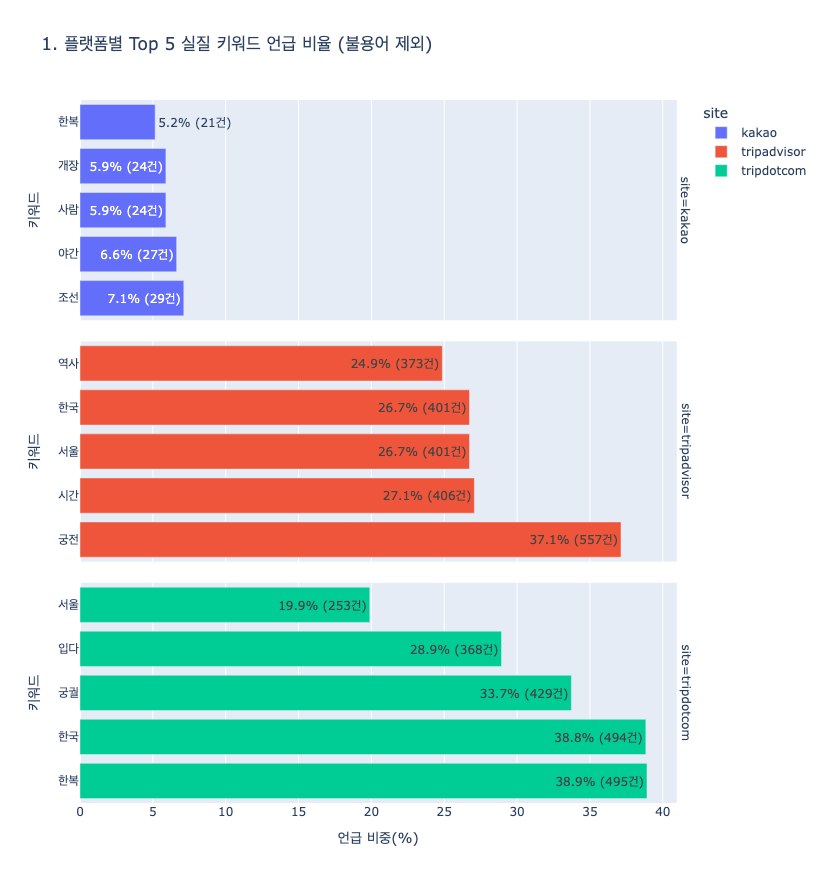
**불용어 제거**: "좋다", "많다", "아름답다" 등 구체적인 정보량이 없는 단순 감정어/형용사를 제외하고 TOP 5 키워드 시각화

<br />
<br />

### 3.3. 시계열 추이 비교

![연도별 리뷰 수 추이]

- **연도별 리뷰 작성 수 추이**
  - **카카오맵**: 2023년(94건)부터 급증하여 2025년(109건)에 정점을 찍는 등 최근 들어 리뷰 유입이 가장 활발
  - **트립어드바이저**: 2016년(711건)과 2017년(591건)에 리뷰가 집중, 이후 감소 추세
  - **트립닷컴**: 코로나 이전인 2019년(200건)과, 2023년(260건), 2024년(208건)에 뚜렷한 피크

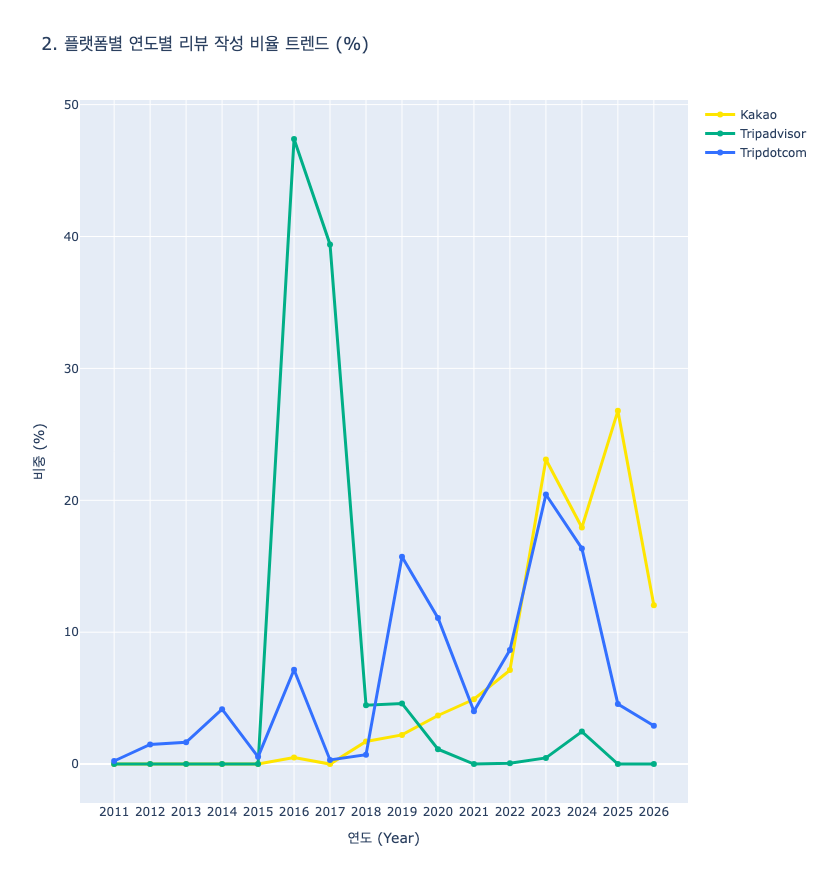

![월별 리뷰 수 추이]

- **월별(계절성) 리뷰 작성 수 추이**
  - **카카오맵**: 5월(74건)에 피크
  - **트립어드바이저**: 5월(177건)부터 7월(182건)까지 초여름에 리뷰가 집중
  - **트립닷컴**: 4월(178건)과 5월(140건)에 가장 활발  

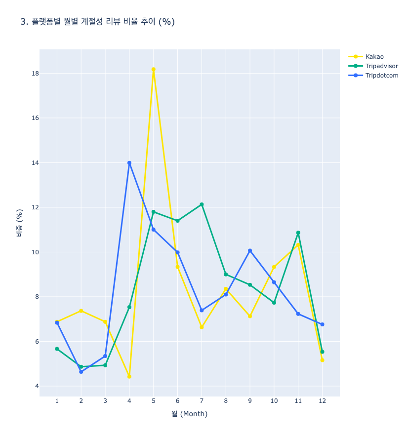

- **요일별 리뷰 작성 수 추이**
  - **카카오맵**: 일요일(18.4%)과 토요일에 리뷰가 폭증, 주말에 경복궁을 찾는 국내 관광객의 추세를 확인할 수 있음.
  - **트립어드바이저**: 주말인 토요일(9.8%)에 오히려 최저, 수·목요일(각 16.7%)에 가장 높음. 요일에 구애받지 않는 외국인 장기 여행객의 방문 패턴
  - **트립닷컴**: 월요일(16.8%)을 제외하면 주중/주말 편차가 적어, 트립어드바이저와 마찬가지로 큰 요일 구분 없이 고루 방문.

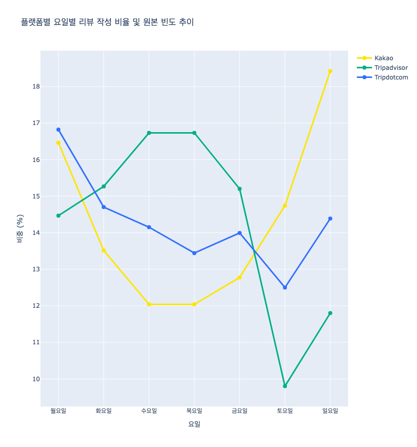

<br />
<br />

### 3.4. 감정 분석 및 감정별 주요 키워드

![감정 분포 비교]

- **별점 기반 감정 라벨링 기준 (4,5점: Positive / 3점: Neutral / 1,2점: Negative)**
- **감정 분포 특징**: 카카오맵(391건/96%), 트립어드바이저(1,382건/92%), 트립닷컴(1,171건/92%) 세 곳 모두 긍정(Positive) 리뷰가 90% 이상을 차지하는 긍정 편향 데이터.

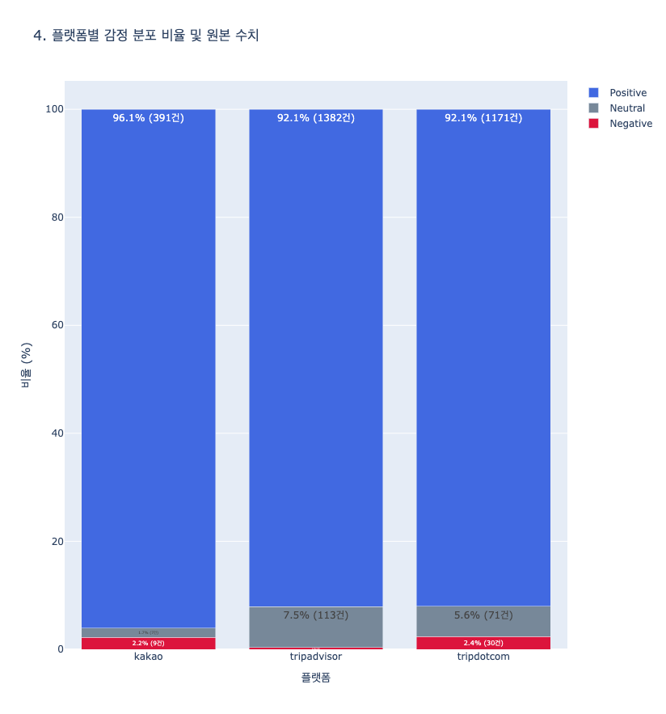

![감정별 키워드 비교]

- **부정 리뷰(Negative) 키워드 분석**
  - **트립닷컴의 명확한 불만 요인**: 부정 리뷰 30건에서 `티켓(14회)`, `환불(14회)`, `플랫폼(13회)`, `예약(6회)`, `낭비(6회)` 등의 키워드가 뚜렷하게 추출됨.
  이는 경복궁 관람 자체와 관련된 사항보다는, 외부 예매 플랫폼의 결제, 환불, 예약 시스템과 관련된 문제가 주요 불만임을 알 수 있음.

- **분석 한계점 (Contextual Limitation)**
  - 카카오맵과 트립어드바이저의 부정 리뷰 키워드에 `많다`, `좋다` 등의 긍정/중립 단어가 추출되었는데, 이는 '좋지 않다'에서 '좋다'를 추출한 것과 같은 방식으로, 기술적 한계로 인한 결과로 추측됨.
  - 부정 리뷰의 개수 자체가 적어, 부정 리뷰에 대한 분석은 유의미한 분석이 아닐 가능성이 있음. 


# [DB, Docker, AWS 과제]

## 1. Docker Hub 주소
- **Docker Image Repository**: https://hub.docker.com/r/seulminbae/ybigta-newbie-4

## 2. GitHub Actions 사진
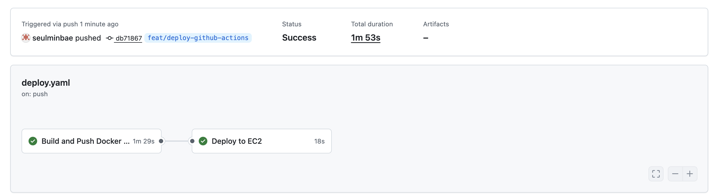

## 3. API Test Results (Swagger UI) 사진
### 1) 회원가입 (Register)
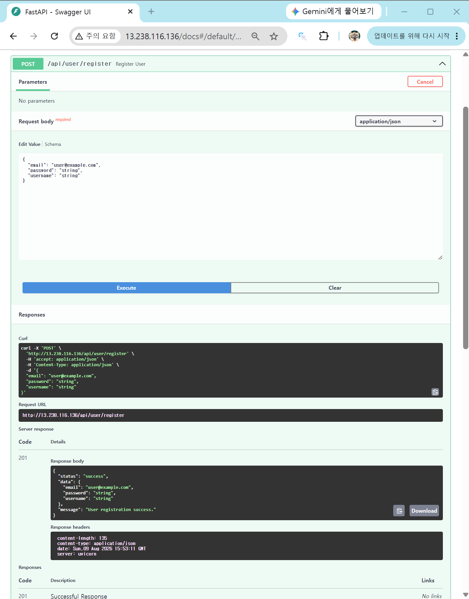

### 2) 로그인 (Login)
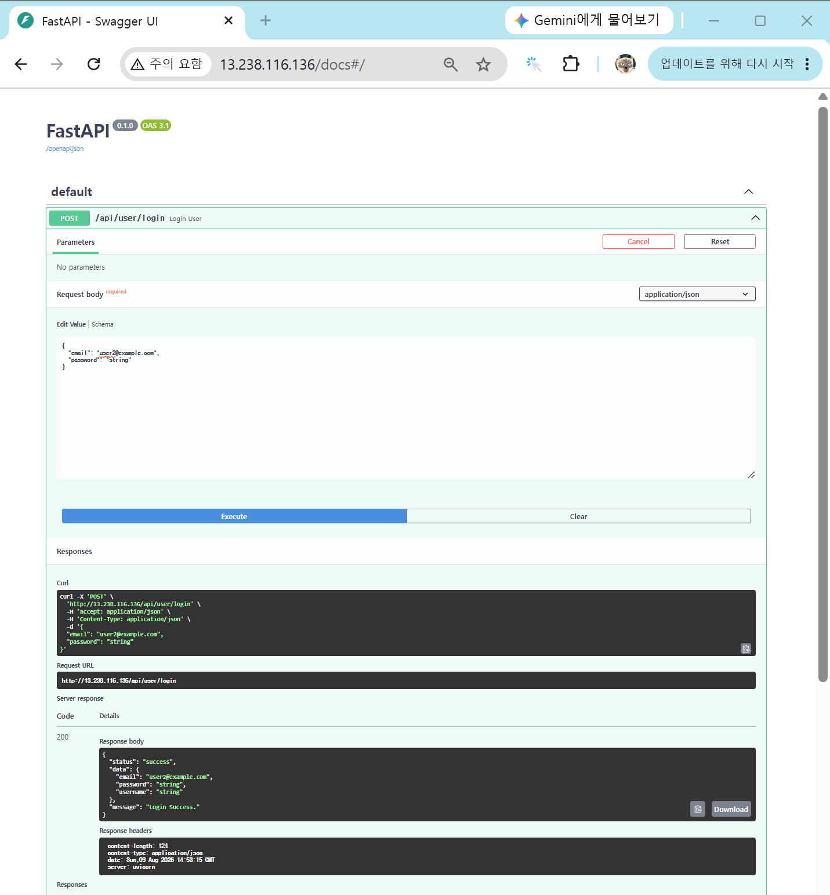

### 3) 비밀번호 변경 (Update Password)
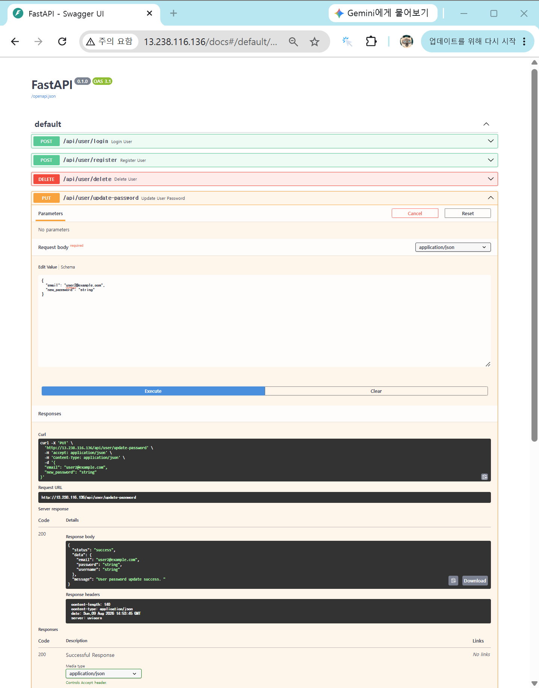

### 4) 회원탈퇴 (Delete User)
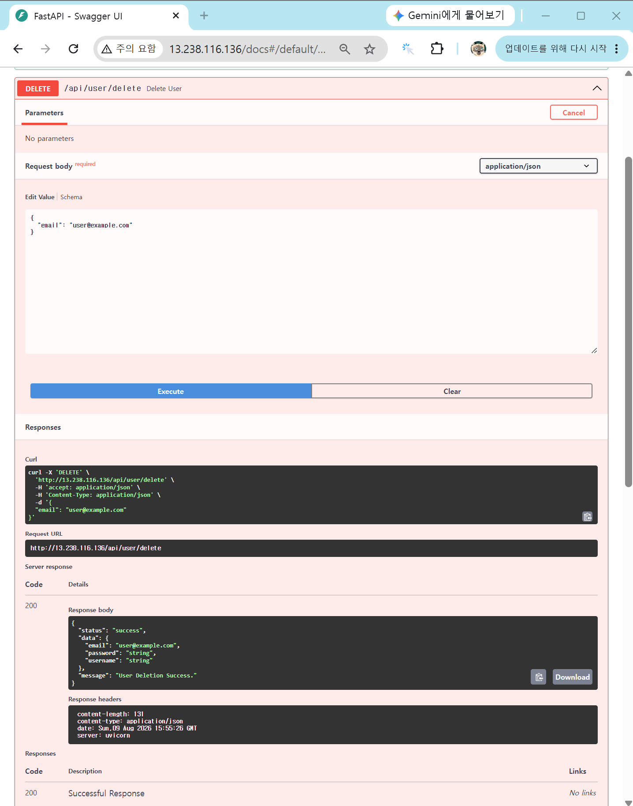

### 5) 리뷰 데이터 전처리 (Preprocess)
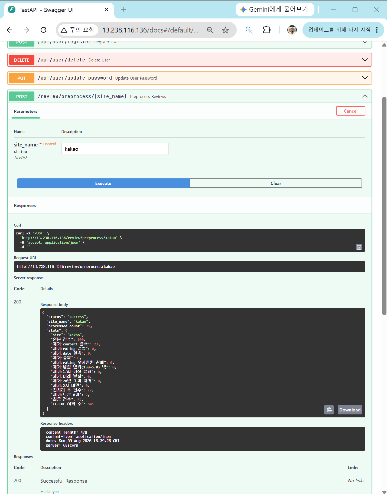


## 4. 과제 느낀 점

### DB
- 계층 분리를 통한 변경 비용 결정
	- JSON 파일 저장을 MySQL로 바꾸는 작업이 user_repository.py와 dependencies.py 두 파일 수정만으로 종료됨
	- service.py가 어떤 저장소를 사용하는지 모르도록 설계되었기 때문임
	- 각 데이터 계층이 서로에 대하여 모르는 것이 유연한 교체 가능성에 이점을 더해줌


- 같은 코드가 DB 종류에 따라 다르게 깨짐
	- Column(String)에 길이를 지정하지 않을 시 SQLite는 무시하고 넘어감, MySQL은 테이블 생성 실패
	- 테스트(SQLite)는 성공하지만, 배포(MySQL)가 실패하는 상황 발생
	- 테스트 환경과 배포 환경을 일치시켜야 함을 알게 되었음


- 데이터 성격에 따른 DB 선택
	- 유저 정보: 고정적 스키마, 무결성 제약이 중요함 -> MySQL 사용
	- 리뷰 데이터: 사이트마다 필드 다름, 전처리 후 필드 늘어남 -> MongoDB 사용
	- DB 선택에 있어서 "어느 DB가 더 좋은가" 가 아니라 "이 데이터에 어느 DB가 적합한가" 가 기준점이 되어야 함


- 클라우드 DB에는 데이터 양을 제한해야 함
	- EC2 t2.micro는 메모리가 1GB임.
	- 로컬에서 3,200건을 처리하던 코드가 EC2에서는 형태소 분석 도중 OOM에러에 의해 프로세스가 종료되었음
	- 적재 스크립트에 --limit 옵션을 두어 사이트당 100건만 넣도록 조절하였음
	- 리소스 제약과 알고리즘 요구사항 사이에서 균형점을 찾아야 함


- 상태 분리 유지를 위한 RDS 사용
	- EC2에 MySQL을 직접 설치해도 동작은 함. 하지만 애플리케이션 서버가 죽거나 교체되면 데이터도 같이 삭제됨
	- 상태 없는 애플리케이션(EC2) + 상태 있는 저장소(RDS) 구조가 되어야 서버를 자유롭게 재생성하거나 늘리고 줄일 수 있음
	- 실제로 컨테이너를 여러 번 지우고 다시 만들었지만 users 테이블은 그대로 유지되었음

### Docker
 - docker 설정 시 local 환경에서는 잘 구동될 수 있지만, 여러 컨테이너가 로컬에 사전에 구동되고 있어서 그럴 수 있음. 주의 필요
 - 관련된 컨테이너를 compose up해서 docker hub에 image로 올리는 과정이 중요.
 - image 권한 설정 read & write 이상으로 해야 작업 원활하게 진행됨.

### AWS
문제: EC2 IP 변경에 따른 네트워크 접속 및 포트 차단 해결
-  EC2 인스턴스 재시작 후 기존 주소로 Swagger UI 접속 및 API 호출 시 Failed to fetch 에러가 발생하며 서버 연결이 차단됨. 고정 IP(Elastic IP)를 할당하지 않은 상태에서 EC2를 재시작함에 따라 퍼블릭 IP가 새로 변경되었고, 인스턴스 재시작으로 인해 기존 Docker 컨테이너 프로세스가 종료되었기 때문임.

- 해결: C2 콘솔에서 새로 할당된 퍼블릭 IP를 확인한 후, 보안 그룹(Security Group)의 인바운드 규칙(80, 22, 8000 포트) 개방 상태를 재점검함. SSH로 EC2에 재접속하여 백엔드 Docker 컨테이너를 재실행(docker run)하고, 변경된 IP 주소로 접속하여 네트워크 통신을 복구함.

- 관련된 개념R
1) 동적 퍼블릭 IP (Dynamic Public IP): AWS EC2 인스턴스는 중지 후 재시작 시 기본적으로 새로운 퍼블릭 IP가 무작위로 재할당됨. 이를 방지하고 고정된 접속 주소를 유지하려면 탄력적 IP(Elastic IP)를 연결해야 함.
2) 보안 그룹 (Security Group): EC2 인스턴스의 가상 방화벽 역할을 수행하며, 인바운드(Inbound) 규칙을 통해 허용된 포트(HTTP 80, SSH 22 등)와 IP 범위의 트래픽만 인스턴스 내부로 진입할 수 있도록 제어함.

### Github
 - secret에 올리는 변수명이 deploy.yaml과 일치하는지 꼼꼼하게 확인 필요
 - deploy 실행할 때 docker 권한이 없어 거부되는 상황이 발생.
  - sudo 명령어 붙여서 원활하게 실행되도록 함.


# Agent 과제

## 데이터와 수집 주기

경복궁의 카카오맵·Trip.com 리뷰를 AWS에서 수집합니다.

EC2의 cron이 30분마다 `collector.run`을 실행합니다.  
수집기는 기존 `review_analysis/crawling` 및 `review_analysis/preprocessing` 코드를 호출한 뒤, 전처리된 리뷰를 RDS MySQL에 업서트합니다.  
같은 리뷰는 `(source_site, content_hash)` 고유 키로 갱신하므로 반복 실행해도 중복 저장되지 않습니다.  


```sql
SELECT source_site, COUNT(*) AS review_count, MAX(collected_at) AS last_collected_at
FROM reviews GROUP BY source_site;
```

## 아키텍처

```text
Internet review sites
        | (every 30 minutes)
EC2 public subnet: collector container + cron
        | 3306, AppSecurityGroup only
RDS MySQL private subnets (Publicly accessible: No)
        ^
EC2 public subnet: future MCP server -- HTTPS reverse proxy
        ^
Next.js on Vercel server -- MCP tool call -- MCP server
```

CloudFormation은 public EC2 subnet 하나와 RDS용 private subnet 두 개를 만듭니다. RDS 보안 그룹의 3306 인바운드는 `AppSecurityGroup`만을 source로 허용하며, CIDR 기반 `0.0.0.0/0:3306` 규칙은 만들지 않습니다. EC2의 22번 포트는 배포자의 `/32` IP만 허용합니다. 80/443은 이후 MCP의 Nginx reverse proxy용이며, MCP 애플리케이션 포트 자체는 열지 않습니다.

DB 권한도 역할별로 분리합니다.

| 계정 | 권한 | 사용하는 구성요소 |
| --- | --- | --- |
| `collector_user` | `SELECT`, `INSERT`, `UPDATE` on `reviews` | scheduled collector |
| `mcp_user` | `SELECT` on `reviews` only | MCP server / Agent |

# YBIGTA Review MCP Server

경복궁 리뷰 크롤러/전처리 결과를 Agent가 안전하게 조회하도록 제공하는 읽기 전용 MCP 서버입니다.
원본 프로젝트와 분리된 독립 프로젝트이며 원본 GitHub 저장소에는 어떤 변경도 하지 않습니다.

## 확인한 데이터 계약

원본 Kakao 크롤러 출력:

| 컬럼 | 의미 |
| --- | --- |
| rating | 1~5점 평점 |
| date | 크롤러가 수집한 작성일 문자열 |
| content | 리뷰 본문 |

전처리 결과 `preprocessed_reviews_kakao.csv`:

| 컬럼 | 타입 | MCP 사용 여부 |
| --- | --- | --- |
| site | string | 필터/출처 |
| date | YYYY-MM-DD | 기간 검색/정렬 |
| rating | float | 평점 필터/집계 |
| content | string | 검색/응답 |
| tokens | 공백 구분 문자열 | 키워드 집계 |
| text_len | int | 평균 길이 집계 |
| token_count | int | 응답 |
| emoji_count | int | 응답 |
| year/month/weekday | int | DB 인덱스 후보 |
| tfidf_svd_00~15 | float | 현재 Tool에서는 노출하지 않음 |

현재 포함된 Kakao 전처리 CSV는 407행입니다. TF-IDF/SVD 값은 검색 결과를 불필요하게
키우므로 MCP 응답에서 제외했습니다.

## 구조

```text
MCP Tool -> ReviewService -> ReviewRepository -> CSV (현재)
                                      \-----> RDS (DB 확정 후)
```

```text
src/review_mcp/
├─ server.py
├─ app.py
├─ auth.py
├─ schemas.py
├─ services/review_service.py
└─ repositories/
   ├─ base.py
   ├─ csv_repository.py
   ├─ rds_repository.py
   └─ factory.py
```

Tool과 Service는 저장소 종류를 모릅니다. `DATA_BACKEND=rds`로 변경하면
`RdsReviewRepository`만 사용되므로 DB 연결 시 다른 계층을 수정하지 않습니다.

## MCP Tools

### 1. `list_review_sources()`

사용 가능한 사이트, 행 수, 최초/최근 리뷰일, 마지막 적재 시간을 반환합니다.

### 2. `get_latest_reviews(site="kakao", limit=10)`

- `site`: `kakao | tripadvisor | tripdotcom`
- `limit`: 1~50
---
### 3. `search_reviews(...)`

- `site`: 허용된 사이트 enum
- `keyword`: 1~100자
- `start_date`, `end_date`: ISO 날짜
- `min_rating`, `max_rating`: 1~5
- `limit`: 1~100
- `offset`: 0~10,000
---
Raw SQL은 받지 않으며 모든 범위는 Pydantic으로 검증합니다.

### 4. `aggregate_review_stats(...)`

`group_by=month|year|weekday` 기준 리뷰 수, 평균 평점, 평균 본문 길이와
긍정(4~5), 중립(3), 부정(1~2) 개수를 반환합니다.
---
### 5. `get_top_review_keywords(...)`

전처리된 `tokens`에서 상위 키워드와 문서 출현 비율을 반환합니다.
`limit`은 1~30입니다.

모든 결과에는 `backend`, 적용 필터, 반환/전체 행 수, 생성 시각,
분석 행 제한으로 잘렸는지 여부가 포함됩니다.
---
## Tool 구조를 이렇게 선택한 이유

Agent가 DB 전체를 가져가 분석하는 대신, 질문 유형별로 필요한 데이터만
선택적으로 조회하도록 Tool을 나눴습니다.

- `list_review_sources`: 데이터 범위 파악 (Agent가 먼저 호출해 상황 인지)
- `get_latest_reviews`: 단순 조회 질문 대응
- `search_reviews`: 조건 검색 질문 대응
- `aggregate_review_stats` / `get_top_review_keywords`: 집계/분석 질문 대응

`execute_sql(sql)` 같은 Raw SQL Tool은 DROP/대량 조회/비정상 쿼리 위험이
있어 제공하지 않습니다. 대신 모든 입력을 Pydantic enum과 범위 제한으로
막고, DB 쿼리는 SQLAlchemy parameterized query로만 구성합니다.

## 계층 구조와 확장 방법

```text
MCP Tool → Service → Repository → CSV / RDS
```

Tool과 Service는 저장소 종류를 모릅니다. 데이터 접근은 `ReviewRepository`
인터페이스(`repositories/base.py`) 뒤에 숨겨져 있습니다.

- **새 데이터 소스 추가** (예: Elasticsearch): `ReviewRepository`를 구현한
  `EsReviewRepository`를 만들고 `factory.py`에 분기 한 줄을 추가합니다.
  Tool/Service 코드는 수정하지 않습니다.
- **새 Tool 추가**: `schemas.py`에 입력/출력 모델 정의 → `ReviewService`에
  메서드 추가 → `server.py`에 `@server.tool()` 등록. 필요 시 Repository에
  조회 메서드를 추가합니다.
- **DB 스키마 변경**: `rds_repository.py`의 Table 선언과 `_to_record()`
  매핑만 수정하면 됩니다.

## MCP 내부 포트 보호

MCP 애플리케이션은 8000 포트에서 실행되지만 인터넷에 직접 노출하지 않습니다.

```text
Internet → Nginx (80) → 127.0.0.1:8000 (MCP)
```

- Docker 컨테이너를 `-p 127.0.0.1:8000:8000`으로 실행해 8000 포트가
  루프백에만 바인딩됩니다.
- EC2 Security Group은 80(HTTP), 22(SSH, 내 IP 한정)만 허용하며
  8000/3306은 열지 않습니다.
- 외부에서 `52.78.12.112:8000` 접속 시 timeout, `52.78.12.112:80/health`만
  응답하는 것을 확인했습니다.

## MCP 인증

모든 `/mcp` 요청에 Bearer Token 인증을 요구합니다.

- 요청 헤더: `Authorization: Bearer <MCP_AUTH_TOKEN>`
- ASGI 미들웨어(`auth.py`)가 모든 MCP 요청을 검사하며, 토큰 비교에는
  타이밍 공격을 막는 `hmac.compare_digest`를 사용합니다.
- 토큰이 없거나 틀리면 401을 반환합니다. `/health`만 인증 없이 열려 있습니다.
- `MCP_AUTH_TOKEN`은 코드에 없고 `.env` 환경변수로만 주입합니다
  (`.gitignore`/`.dockerignore`로 커밋·이미지 포함 차단).
- 추가로 `MCP_ALLOWED_HOSTS` 기반 DNS rebinding 방어를 적용했습니다.
- CORS는 인증 수단이 아니므로 인증은 전적으로 Bearer Token이 담당합니다.
